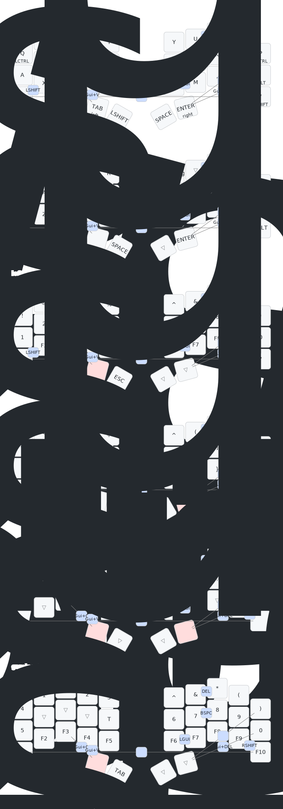

# ZMK Config

I added support for ZMK studio, event listeners for layer changes to support [OverKeys](https://github.com/conventoangelo/OverKeys/), and added a workflow to create the keymap diagram below.

